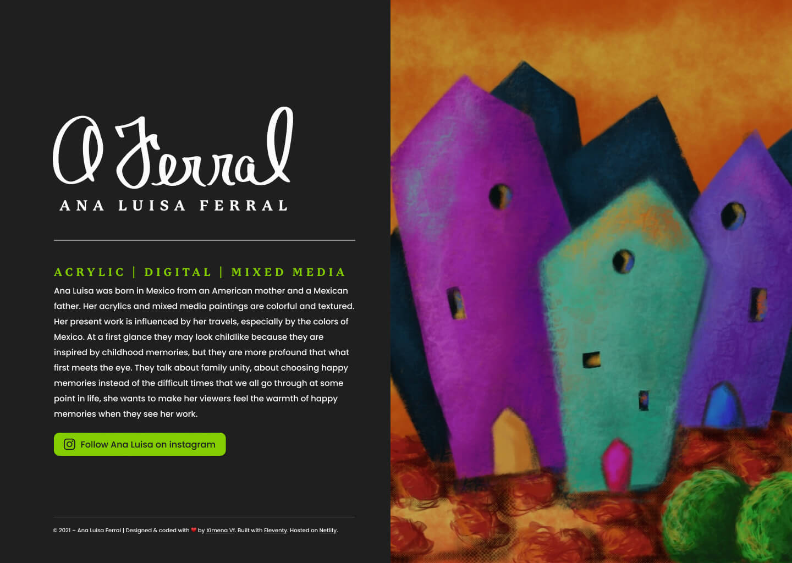

# Ana Luisa Ferral's Website

Based on Phil Haweskworh's [simple-sassy-scaffold](https://github.com/philhawksworth/11ty-scaffold-with-sass), a basic scaffold for an 11ty site with Sass pipeline starting point for an 11ty site. 

Designed &amp; developled by [Ximena Vila Ferral](https://ximenavf.com/).